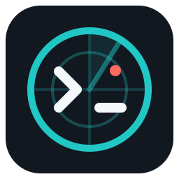

<p align="center">
  <a href="README.md">English</a> | <a href="README.ko.md"><strong>한국어</strong></a>
</p>

<p align="center">
  
</p>

<h1 align="center">Codex Radar</h1>

<p align="center">
  <strong>프로젝트별 Codex 스레드를 한눈에 확인하세요.</strong><br>
  실행 중인 작업과 확인이 필요한 상태를 보고, 올바른 워크스페이스에서 바로 이어갈 수 있습니다.
</p>

<p align="center"><strong>공개 베타 · v0.4.4</strong></p>

Codex Radar는 여러 프로젝트에서 Codex를 사용하는 개발자를 위한 로컬 대시보드이며, 특히 VS Code Remote SSH 환경에 적합합니다. 스레드를 프로젝트별로 묶고, 승인 요청과 완료된 작업을 보여주며, 제한된 범위의 대화 미리보기를 제공합니다. 또한 이어갈 수 있는 스레드를 적절한 워크스페이스의 공식 Codex 확장으로 연결합니다.

공개 베타는 POSIX helper bundle과 VSIX를 포함한 [v0.4.4 GitHub Release](https://github.com/plaonn/codex-radar/releases/tag/v0.4.4)로 배포됩니다. VS Code Marketplace나 PyPI에는 게시되어 있지 않습니다.

## 주요 기능

- VS Code Activity Bar의 `Attention`, `Projects`, `Archived` 전용 보기와 편집기 대시보드를 제공합니다.
- 프로젝트별 탐색과 함께 실행, 승인 요청, 완료/읽음, 알 수 없음, 오래됨, 보관됨 상태를 명확하게 구분합니다.
- 범위가 제한되고 민감 정보가 제거된 대화 미리보기를 제공하며, 필요하면 캐시된 요약을 대신 보여줍니다.
- Remote SSH 창을 포함하여 이어갈 수 있는 스레드를 적절한 워크스페이스의 Codex로 연결합니다.
- 로컬 인덱스가 없거나 비어 있거나 오래되었거나 유효하지 않거나 지원되지 않을 때 설정 진단을 보여줍니다.
- 터미널 및 헤드리스 환경을 위한 외부 의존성 없는 Python CLI와 TUI를 제공합니다.
- 로컬 보존 기간 설정과 사용자가 직접 실행하는 포그라운드 터미널 감시 기능을 제공합니다.

## 동작 방식

Codex Radar는 같은 호스트에서 동작하는 두 부분으로 구성됩니다. Helper/indexer는 사용자가 명시적으로 설정한 Codex lifecycle hook 이벤트를 받아 각 스레드의 마지막으로 알려진 상태를 유지합니다. VS Code 확장은 이 로컬 인덱스를 읽기 전용으로 사용하는 클라이언트입니다. 확장만 설치해서 사용하는 제품이 아니며, 확장 자체가 인덱스를 생성하지 않습니다.

현재 source extension에는 선택적인 thread title/archive 보강과 supported rate-limit usage 조회를 위한 읽기 전용 Codex App Server Controller도 포함되어 있습니다. Controller는 사용자가 별도로 설치한 compatible Codex CLI를 실행하며, VSIX는 Codex를 번들하거나 공식 Codex extension의 private runtime 경로를 재사용하지 않습니다. App-server runtime status는 해당 process가 load한 thread에 한정되므로 Python helper/indexer가 lifecycle attention source를 계속 담당합니다.

```text
Codex lifecycle 이벤트
  -> ~/.local/bin/codex-radar-hook
  -> 호스트 로컬 sessions.json
  -> VS Code 확장 / CLI / TUI
```

인덱스는 권위 있는 실시간 프로세스 상태가 아니라 관측된 lifecycle 상태를 기록합니다. 예를 들어 `waiting_approval`은 Radar가 권한 요청을 관측했다는 뜻이고, `done`은 중지 이벤트 또는 더 최신인 persisted rollout turn-completion event를 관측했다는 뜻입니다. `stale`은 활성 상태로 보이지만 최근 lifecycle evidence가 없는 세션에 표시되는 상태입니다. Turn 종료는 모든 작업 요구사항이나 검증 단계가 성공했다는 증거가 아닙니다.

상태는 다음 중 우선 적용되는 위치에 저장됩니다.

```text
$CODEX_RADAR_HOME
%LOCALAPPDATA%\codex-radar\state (Native Windows)
$XDG_STATE_HOME/codex-radar
~/.local/state/codex-radar
```

현재 읽기 계약은 [세션 캐시 v1 스키마](docs/schemas/session-cache-v1.schema.json)와 [예시 인덱스](examples/sessions.json)에서 확인할 수 있습니다.

## 요구 사항

- Codex가 실행되는 호스트의 Python 3.9 이상이 필요합니다.
- Lifecycle hook을 지원하는 Codex와 `~/.codex/hooks.json`을 설정할 권한이 필요합니다.
- 확장을 사용하려면 VS Code 1.90 이상이 필요합니다.
- `Open in Codex` 연결을 사용하려면 공식 Codex 확장이 필요합니다.

Remote SSH에서는 helper 설치, hook 설정, VSIX 설치를 모두 원격 확장 호스트에서 진행해야 합니다. Codex Radar는 해당 호스트의 상태와 transcript를 읽습니다. 현재 source tree에는 `%LOCALAPPDATA%`, stable `.cmd` shim, `windows-latest` CI를 사용하는 Native Windows helper foundation이 포함되어 있습니다. 실제 Codex hook-to-sidebar smoke가 성공하기 전에는 Native Windows 지원 완료로 선언하지 않습니다. WSL2는 이번 milestone의 공식 검증 범위에서 제외됩니다.

## Helper 설치

v0.4.4 release는 Python 3.9 이상 POSIX host용 helper bundle을 제공합니다. Installer는 checksum을 검증하고 변경 불가능한 runtime version을 보존하며, Codex hook 설정을 바꾸지 않고 원자적 upgrade와 rollback을 제공합니다. v0.4.4 Release에서 bundle과 인접 checksum을 다운로드한 다음 실행합니다.

```bash
shasum -a 256 -c codex-radar-helper-0.4.4.zip.sha256
unzip codex-radar-helper-0.4.4.zip
cd codex-radar-helper-0.4.4
python3 install-helper.py install .
```

Codex가 사용하는 것과 같은 호스트 및 shell 환경에서 helper를 실행할 수 있는지 확인합니다.

```bash
codex-radar doctor
codex-radar path
```

Release helper bundle은 다운로드한 bundle을 검증하고 압축을 푼 뒤 `python3 install-helper.py install .`로 설치합니다. SHA-256 검사는 손상을 탐지하지만 bundle이나 bootstrap installer의 출처를 독립적으로 인증하지는 않습니다. 의도한 GitHub Release/account에서 신뢰할 수 있는 TLS 연결로 모든 asset을 받아야 합니다. Stable shim, 상태 확인, rollback, migration 절차는 [hook 설치 runbook](docs/runbooks/install-hooks.md)을 참고합니다.

## Codex Hook 설정

Hook은 사용자가 명시적으로 설정해야 합니다. Codex Radar는 hook을 자동 설치하거나 `~/.codex/hooks.json`을 수정하거나 관련 없는 hook을 덮어쓰지 않습니다. Release bundle은 고정 절대 경로인 `~/.local/bin/codex-radar-hook` shim을 제공하므로 helper upgrade 때 hook config를 다시 바꿀 필요가 없습니다.

1. Release bundle을 사용하면 `codex-radar-helper hook-config`를 실행합니다. 그렇지 않으면 [`examples/hooks.json`](examples/hooks.json)을 검토하고 `/home/YOUR_USER`를 실제 절대 경로로 바꿉니다.
2. Codex가 실행되는 호스트의 `~/.codex/hooks.json`에 출력된 `hooks` 객체를 병합합니다. 파일을 쓰지 않고 diff만 확인하려면 `codex-radar-helper hook-config --hooks-file ~/.codex/hooks.json`을 사용합니다.
3. Codex를 시작하거나 resume합니다. Hook 검토가 요청되면 `/hooks`에서 내용을 확인하고 신뢰하도록 설정합니다.
4. 짧은 Codex turn을 실행한 다음 인덱스를 확인합니다.

   ```bash
   codex-radar sessions
   codex-radar tui
   ```

제거 절차를 포함한 전체 과정은 [hook 설치 runbook](docs/runbooks/install-hooks.md)을 따릅니다.

## VSIX 설치

[v0.4.4 공개 베타 Release](https://github.com/plaonn/codex-radar/releases/tag/v0.4.4)에서 [`codex-radar-vscode-0.4.4.vsix`](https://github.com/plaonn/codex-radar/releases/download/v0.4.4/codex-radar-vscode-0.4.4.vsix)를 다운로드한 다음, Codex와 Radar 상태가 있는 VS Code 확장 호스트에 설치합니다.

```bash
code --install-extension codex-radar-vscode-0.4.4.vsix --force
```

Remote SSH에서는 원격 창에 연결한 상태에서 VSIX를 설치해야 워크스페이스 확장이 원격 helper 및 인덱스와 같은 곳에서 실행됩니다. 창을 다시 불러온 다음 Activity Bar에서 **Codex Radar**를 엽니다.

## 사용법

VS Code 사이드바에서는 확인이 필요한 작업과 프로젝트 그룹을 계속 볼 수 있습니다. 더 넓은 대시보드는 **Codex Radar: Open Dashboard**로 열고, 세션을 선택해 미리보기를 확인합니다. 보관되지 않았고 이어갈 수 있는 스레드는 **Open in Codex**로 열 수 있습니다. 스레드가 다른 워크스페이스에 속하면 기본 `codexRadar.openThreadBehavior` 설정에 따라 해당 프로젝트를 새 창에서 열지, 현재 창에서 계속할지 묻습니다.

터미널 인터페이스에서도 같은 로컬 인덱스를 확인할 수 있습니다.

```bash
codex-radar sessions
codex-radar sessions --group-project
codex-radar sessions --model gpt-5 --since 2h
codex-radar sessions --status stale
codex-radar transcript <session-id>
codex-radar tui --project codex-radar --since 1d
codex-radar reconcile --dry-run
codex-radar watch
codex-radar usage
```

보존 기간은 Radar 세션 인덱스에만 적용되며 기본값은 7일입니다. Codex transcript, 공식 스레드, 보관 상태는 삭제하지 않습니다.

장기 실행 양방향 Codex app-server connection이 필요한 로컬 또는 SSH client를 위해 opt-in 실험적 thread host도 제공합니다.

```bash
codex-radar thread rpc --codex-command /path/to/codex
```

foreground terminal workflow에서는 먼저 별도 설치한 실행 파일을 점검한 뒤 one-shot command를 사용합니다. 각 command는 같은 Radar-owned host 구현을 재사용하며 daemon을 시작하거나 Codex config를 변경하지 않습니다.

```bash
codex-radar thread doctor --codex-command /path/to/codex
codex-radar thread start "이 저장소를 요약해줘" --cwd "$PWD"
codex-radar thread list
codex-radar thread read THREAD_ID --turn-limit 8
codex-radar thread send THREAD_ID "다음 안전한 단계로 계속 진행해줘."
```

stdin에서 한 줄에 JSON request 하나를 읽고 stdout에 JSON response 하나를 출력합니다. 지원 method는 `initialize`, `thread/start`, `thread/list`, `thread/read`, `thread/send`, `shutdown`입니다. 이 host가 시작한 thread에는 bounded `create_thread`, `list_threads`, `read_thread`, `send_message_to_thread` dynamic tool이 주입됩니다. Network listener나 daemon을 설치하지 않고 Codex config를 수정하지 않으며 command/file/permission request를 자동 승인하지 않습니다.

```bash
codex-radar config get retention_days
codex-radar config set retention_days 14
codex-radar prune --dry-run
codex-radar prune
```

Bash, Zsh, Fish용 shell completion script도 제공됩니다.

```bash
codex-radar completion zsh > ~/.zfunc/_codex-radar
codex-radar completion bash > ~/.local/share/bash-completion/completions/codex-radar
codex-radar completion fish > ~/.config/fish/completions/codex-radar.fish
```

## 개인정보 보호 및 보안

- 세션 메타데이터, transcript에서 가져온 미리보기, 사용량 snapshot은 확장 호스트에만 남으며 Codex Radar는 cloud sync를 제공하지 않습니다.
- 기본 인덱스는 스레드별 마지막으로 알려진 상태만 저장하며 raw hook event log를 보관하지 않습니다.
- 사이드바와 대시보드는 정제된 메타데이터와 민감 정보가 제거된 snippet을 사용하며 raw transcript 경로를 표시하지 않습니다.
- 확장은 `sessions.json`을 읽기 전용으로 감시합니다. Hook, transcript, 세션 인덱스, 서버 측 `config.json`을 수정하지 않습니다.
- 실험적 사용량 adapter는 `auth.json`을 읽거나 서버에 요청하거나 raw rollout 내용을 저장하지 않고 호스트 로컬 Codex rollout log를 읽습니다.
- Transcript와 세션 데이터에는 민감한 로컬 정보가 포함될 수 있습니다. Hook 설정을 검토하고 Radar 상태 디렉터리를 적절히 보호해야 합니다.

## 현재 제한 사항

- 공개 베타는 GitHub Release로만 배포하며 VS Code Marketplace나 PyPI에서는 제공하지 않습니다.
- Helper foundation은 POSIX와 Native Windows Python 3.9+ host를 지원합니다. Published `v0.4.4` bundle은 여전히 POSIX 전용이며, Native Windows 지원 완료에는 실제 Codex hook-to-sidebar smoke가 남아 있습니다.
- WSL2는 Native Windows milestone의 공식 검증 범위에 포함되지 않습니다.
- `codex-radar-helper diagnose`는 로컬 runtime, stable shim, compatibility metadata, hook wiring을 확인하지만 원격 최신 release 존재 여부는 조회하지 않습니다. `codex-radar doctor`는 Radar state/cache 진단에 집중합니다.
- 확장을 사용하려면 별도의 host-local helper/indexer 설치와 명시적인 hook 설정이 필요합니다.
- `Open in Codex`는 실험적인 로컬 URI 경로를 사용하므로 일부 세션에서는 사용할 수 없습니다.
- 보관된 세션은 Codex 연결로 열 수 없습니다.
- 대화 미리보기 범위는 제한되어 있으며 Codex의 native transcript 보기를 대체하지 않습니다.
- OS 알림이나 외부 알림은 제공하지 않습니다. VS Code의 attention 보기와 사용자가 직접 실행하는 터미널 watcher를 사용할 수 있습니다.
- Lifecycle 상태는 지속적인 프로세스 감시가 아니라 관측된 hook과 더 최신인 persisted rollout terminal event의 bounded reconciliation을 기준으로 합니다.

## 개발 및 테스트

개발용 editable install은 다음과 같이 설정합니다.

```bash
python3 -m venv .venv
. .venv/bin/activate
python -m pip install -e .
```

Python 및 확장 테스트 suite는 다음 명령으로 실행합니다.

```bash
PYTHONPATH=src python3 -m unittest discover
python3 -m compileall src tests
npm --prefix extensions/vscode test
```

Helper release는 먼저 version을 올린 pure-Python wheel을 만든 다음 compatibility/checksum manifest 및 standalone installer와 함께 패키징합니다.

```bash
python scripts/build-helper-bundle.py \
  --wheel dist/codex_radar-<version>-py3-none-any.whl \
  --output dist/codex-radar-helper-<version>.zip
```

명령은 인접한 `.sha256` 파일도 생성합니다. Versioned artifact는 release 산출물이며 commit하면 안 됩니다.

Maintainer는 다음 명령으로 로컬 VSIX를 패키징할 수 있습니다.

```bash
npm --prefix extensions/vscode run package
```

생성되는 `extensions/vscode/codex-radar-vscode-<version>.vsix`는 gitignore된 release artifact이며 commit하면 안 됩니다. Remote SSH smoke test와 release checklist는 [확장 가이드](extensions/vscode/README.md)를 참고합니다.

## 릴리스 및 배포

현재 릴리스는 [Codex Radar 0.4.4 공개 베타](https://github.com/plaonn/codex-radar/releases/tag/v0.4.4)입니다. 공개 베타의 지원되는 배포 경로는 GitHub Release asset입니다. Marketplace 및 PyPI 게시는 별도의 향후 결정으로 남아 있습니다.

자세한 내용은 [0.4.4 릴리스 노트](docs/releases/0.4.4.md)와 [확장 변경 이력](extensions/vscode/CHANGELOG.md)을 참고합니다.

## 문서 및 지원

- [요구 사항](docs/REQUIREMENTS.md)
- [현재 사양](docs/SPEC.md)
- [로드맵](docs/ROADMAP.md)
- [Hook 설치 runbook](docs/runbooks/install-hooks.md)
- [VS Code 확장 가이드](extensions/vscode/README.md)
- [버그 신고 및 기능 요청](https://github.com/plaonn/codex-radar/issues)
- [MIT 라이선스](LICENSE)
